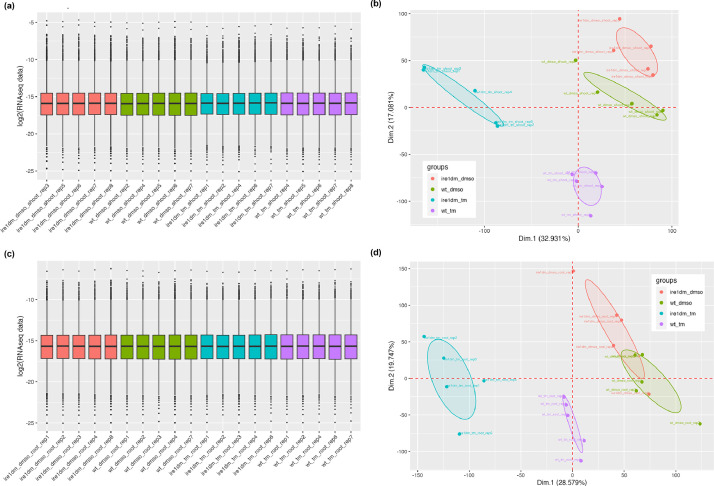
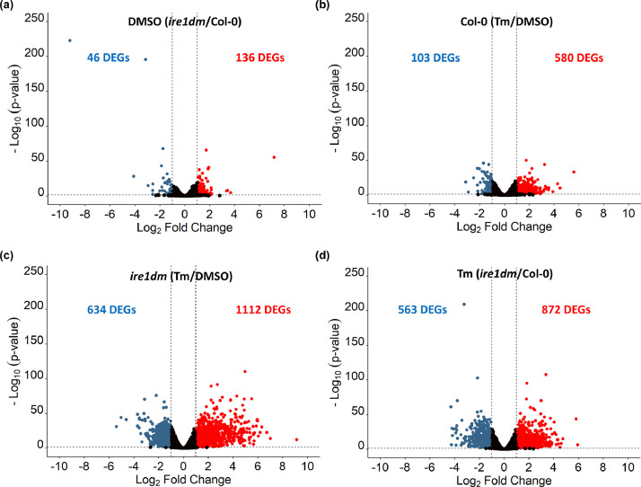
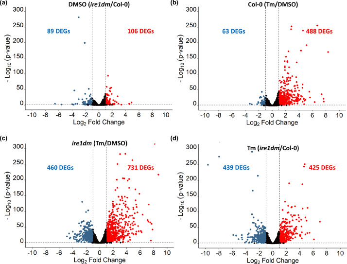

## **Hide unnecessary message**

```{r}
knitr::opts_chunk$set(
  message = FALSE,
  warning = FALSE
)
```

## Introduction

The original study investigated how the unfolded protein response (UPR) regulates gene expression during endoplasmic reticulum (ER) stress in *Arabidopsis thaliana*. The UPR is a conserved cellular pathway that maintains protein-folding homeostasis within the endoplasmic reticulum. A key component of this pathway is **IRE1**, an ER stress sensor that activates downstream transcriptional responses when unfolded proteins accumulate.

To examine the role of IRE1 in transcriptional responses to ER stress, the authors performed RNA sequencing (RNA-seq) on wild-type plants (**Col-0**) and an **ire1dm** mutant lacking functional IRE1 signaling. Plants were treated with either **DMSO** (control) or **tunicamycin (Tm)**, a compound that induces ER stress by disrupting protein glycosylation. RNA-seq data were collected from both **shoot** and **root** tissues, allowing the authors to investigate how genotype and ER stress affect gene expression patterns across tissues.

In this replication, I performed four main types of analyses to reproduce key findings from the original study. 1. I conducted a descriptive statistical analysis by summarizing RNA-seq mapping quality metrics (e.g., total reads, mapping rate, and unique alignment rate). 2. I generated data visualizations, including boxplots of normalized expression distributions and principal component analysis (PCA) plots, to assess sample quality and clustering patterns across experimental conditions. 3. I performed inferential statistical analysis using differential gene expression methods (DESeq2 and edgeR), which apply negative binomial models to identify genes with significant expression changes between conditions. 4. I conducted a second inferential analysis by generating volcano plots to visualize the magnitude and statistical significance of differential expression results. All output files are provided in the reanalysis_data directory

Raw sequencing reads were downloaded from the ENA database (ERP141604) and mapped to the Arabidopsis thaliana reference genome (TAIR10), using the genome sequence file (Arabidopsis_thaliana.TAIR10.dna.toplevel.fa) and gene annotation file (Arabidopsis_thaliana.TAIR10.57.gtf). Due to the large size of the sequencing data, initial preprocessing steps—including read alignment and the generation of the gene count matrix (gene_count_matrix.txt) was performed on the TACC computing cluster using shell scripts (provided in the reanalysis_data directory as mapping_matrix.sh). Subsequent statistical analyses and data visualizations, including differential gene expression analysis, were conducted in R.

The goal of this replication is to evaluate whether similar patterns of differential gene expression and sample clustering can be reproduced from the publicly available dataset.

## Variable dictionary

```{r}
# load packages
library(knitr) # create formatted tables
library(kableExtra) # improve table appearance
library(readxl) # read Excel files

# create a variable dictionary table
variable_dictionary <- data.frame(
  Variable = c(
    "mapping_table",
    "paper_table",
    "counts",
    "meta",
    "dds",
    "res",
    "res_df",
    "sig",
    "sig_df",
    "dge",
    "logCPM",
    "group",
    "fit"
  ),
  Description = c(
    "Summary table of RNA-seq read mapping statistics generated during preprocessing",
    "Original mapping statistics table reported in the published paper",
    "Gene count matrix where rows are genes and columns are RNA-seq samples",
    "Sample metadata table containing genotype, treatment, and tissue information",
    "DESeq2 dataset object storing count data and experimental design",
    "Differential expression test results produced by DESeq2",
    "Data frame version of DESeq2 results used for visualization and tables",
    "Subset of genes with adjusted p-value < 0.05",
    "Data frame containing significant differentially expressed genes",
    "edgeR object used for normalization and downstream RNA-seq analysis",
    "Normalized log counts-per-million (logCPM) expression values",
    "Experimental group labels combining genotype and treatment",
    "edgeR model fit object used for differential expression testing"
  )
)

# print dictionary table
kable(variable_dictionary,
      caption = "Dictionary of variables used in the analysis") |>
  kable_styling(full_width = FALSE)
```

## Mapping results (Descriptive statistical analysis)
```{r}
# read mapping table
mapping_table <- read.table(
  "reanalysis_data/mapping_table.txt",
  header = TRUE,
  sep = "",
  check.names = FALSE
)
# display the first 10 rows of mapping table
kable(head(mapping_table,10),
      caption = "Mapping summary of RNA-seq reads") |>
  kable_styling(full_width = FALSE)

# original table from the paper
## read original table from paper
paper_table <- read_excel("data/Table_1.xlsx")
# display the first 10 rows of the original table
kable(head(paper_table,10),
      caption = "Original Table 1 from the study") |>
  kable_styling(full_width = FALSE)
```
###### The mapping statistics from this replication are broadly consistent with those reported in the original study. In the published results, mapping rates are typically around 99–99.7% with uniquely mapped reads around 98%, whereas the replicated data show slightly lower mapping rates (~98–98.5%) and uniquely mapped reads (~96–97%). Despite this small discrepancy, the overall mapping quality remains high and within the expected range for RNA-seq experiments, indicating that the preprocessing pipeline produced reliable alignment results comparable to those in the original study.

## Differential expression analysis/DESeq2 (Inferential statistical analysis)

```{r}
# load package, which provides function for RNA-seq normalization and differential expression analysis using negative binomial models
library(DESeq2)
# read matrix, which includes sample, gene, and counts information
counts <- read.table("reanalysis_data/gene_count_matrix.txt",
                     header=TRUE,
                     row.names=1)
# read sample metadata table, which contains experimental information for each sample
meta <- read.csv("reanalysis_data/metadata.csv",
                 row.names=1)
head(counts)
head(meta)

# reorder counts to match metadata
counts <- counts[, rownames(meta)]
# create a DESeq2 dataset object
dds <- DESeqDataSetFromMatrix(
    countData = counts,
    colData = meta,
    design = ~ genotype + treatment + tissue
)
# run DESeq2, including normalization, dispersion estimation, and differential expression testing
dds <- DESeq(dds)
# extract differential expression results
res <- results(dds)
# convert to data frame
res_df <- as.data.frame(res)
# show first 10 rows
kable(head(res_df,10),
      caption = "First 10 differential expression results") |>
  kable_styling(
    bootstrap_options = c("striped","hover"),
    full_width = FALSE,
    position = "left"
  )

# Select significantly differently expressed genes
## keep genes only with adjusted p-value < 0.05
sig <- res[which(res$padj < 0.05), ]
## convert results into a standard data frame format for easily manipulated
sig_df <- as.data.frame(sig)
## add a new column call "gene_id"
sig_df$gene_id <- rownames(sig_df)
head(sig_df)
## save table
write.csv(sig_df, "significant_DEGs.csv", row.names = FALSE)
```
###### The differential expression analysis identified a large number of genes with significant expression changes (adjusted p-value < 0.05), consistent with the original study, which reported several hundred differentially expressed genes under tunicamycin treatment. Although the exact number of significant genes differs from the published results, this discrepancy is expected and primarily reflects differences in analysis parameters and filtering criteria. The presence of large log2 fold changes and highly significant p-values indicates that the core transcriptional response to ER stress is robustly captured.


## Figure 2: quality control of the sequenced RNA biological replicates (Visualization)

```{r}
# load packages
library(edgeR) # normalization and RNA-seq count processing
library(ggplot2)
library(reshape2) # reshaping data from wide to long format
library(dplyr)

# global text size
TEXT_SIZE <- 10

# edgeR normalization
## create an edgeR object containing the raw read counts
dge <- DGEList(counts=counts)
## define experimental groups
group <- interaction(meta$genotype,
                     meta$treatment,
                     meta$tissue)
## filter out genes with very low expression
keep <- filterByExpr(dge, group=group)
## keep expressed genes and update library sizes
dge <- dge[keep,,keep.lib.sizes=FALSE]
## TMM noemalization
dge <- calcNormFactors(dge)
## convert normalized counts to logCPM (log counts per million)
logCPM <- cpm(dge, log=TRUE)

# define colors for different experimental groups
group_colors <- c(
  "ire1_dmso"="#F8766D",
  "wt_dmso"  ="#7CAE00",
  "ire1_tm"  ="#00BFC4",
  "wt_tm"    ="#C77CFF"
)

# function to generate boxplots showing expression distributions
plot_distribution <- function(data, meta, title){
  df <- reshape2::melt(data) # convert expression matrix to long format (one gene one row)
  colnames(df) <- c("gene","sample","value") # rename columns for clarity
  ## assign experimental group labels to each sample
  df$group <- paste(meta[df$sample,"genotype"],
                    meta[df$sample,"treatment"],
                    sep="_")
  df$sample_name <- meta[df$sample,"sample"] # extract sample name from metadata
  ## ensure the sample order is preserved in the plot
  df$sample_name <- factor(df$sample_name,
                           levels=unique(df$sample_name))
  ## boxplot showing expression distribution
  p <- ggplot(df, aes(sample_name, value, fill=group)) +
    geom_boxplot(outlier.size = 0.2) +
    scale_fill_manual(values=group_colors) +
    theme_gray(base_size = TEXT_SIZE) +
    labs(
      title=title,
      y="log2(RNAseq data)",
      x=""
    ) +
    theme(
      axis.text.x = element_text(angle=60, hjust=1, size=7),
      legend.position="right"
    )
  return(p)
}

# function to generate PCA plot for visulizing sample similarity
plot_pca <- function(data, meta, title){
  pca <- prcomp(t(data)) # perform PCA
  ## calculate percentage of variance explained by each principal component
  percentVar <- round(100*(pca$sdev^2/sum(pca$sdev^2)),1) 
  df <- data.frame(pca$x, meta) # combine PCA coordinates with sample metadata
  ## create group labels combining genotype and treatment
  df$group <- paste(df$genotype, df$treatment, sep="_") 
  ## generate PCA scatter plot
  p <- ggplot(df, aes(PC1, PC2, color=group, group=group)) +
    geom_point(size=3) +
    geom_path(alpha=0.5) +
    stat_ellipse(linewidth=0.8) +
    geom_vline(xintercept=0, linetype="dashed",
               color="red", alpha=0.6) +
    geom_hline(yintercept=0, linetype="dashed",
               color="red", alpha=0.6) +
    scale_color_manual(values=group_colors) +
    theme_gray(base_size = TEXT_SIZE) +
    labs(
      title=title,
      x=paste0("Dim 1 (",percentVar[1],"%)"),
      y=paste0("Dim 2 (",percentVar[2],"%)"),
      color="group"
    )
  return(p)
}

# shoot plots
## select samples belong to shoot tissues
shoot_samples <- rownames(meta[meta$tissue=="shoot",])
## extract logCPM expression values for shoot samples
shoot_data <- logCPM[, shoot_samples]
## generate boxplot showing expression distribution in shoot samples
p1 <- plot_distribution(shoot_data,
                        meta[shoot_samples,],
                        "(a) Shoot")
## generate PCA plot for shoot samples
p2 <- plot_pca(shoot_data,
               meta[shoot_samples,],
               "(b) Shoot PCA")

# root plots (same with for shoot)
root_samples <- rownames(meta[meta$tissue=="root",])
root_data <- logCPM[, root_samples]

p3 <- plot_distribution(root_data,
                        meta[root_samples,],
                        "(c) Root")
p4 <- plot_pca(root_data,
               meta[root_samples,],
               "(d) Root PCA")

# original figure from the paper
#| out-width: "80%"


# print plots
print(p1)
print(p2)
print(p3)
print(p4)
```
###### The PCA results show clear clustering of samples by treatment and genotype, which is consistent with the original study where the first two principal components capture major biological variation across conditions (Fig. 2 in the paper). In both the replicated and published results, samples exposed to tunicamycin separate from control samples, indicating a strong transcriptional response to ER stress. Minor differences in cluster tightness and separation may reflect differences in normalization or filtering strategies.

## Figure 3: volcano plot for shoot (Second inferential / visualization hybrid)

```{r}
# select shoot samples
## keep only shoot samples from metadata
shoot_meta <- meta[meta$tissue == "shoot", ]
## extract corresponding count matrix columns
shoot_counts <- counts[, rownames(shoot_meta)]

# define experimental groups for shoot samples
group <- paste(shoot_meta$genotype,
               shoot_meta$treatment,
               sep = "_")
# create an edgeR DGEList object containing raw counts
dge <- DGEList(counts = shoot_counts)
# store group labels in the sample information slot of the edgeR object
dge$samples$group <- factor(group)
# filter low-expression genes
keep <- filterByExpr(dge, group = dge$samples$group)
# keep expressed genes
dge <- dge[keep, , keep.lib.sizes = FALSE]
# calculate TMM
dge <- calcNormFactors(dge)

# build design matrix for group comparisons
design <- model.matrix(~0 + group) # ~0 removes the intercept to get own coefficient 
colnames(design) <- levels(dge$samples$group) # rename design matrix columns
# estimate dispersion
dge <- estimateDisp(dge, design)
# fit quasi-likelihood negative binomial model
fit <- glmQLFit(dge, design)

# define a function to generate volcano plots for differential expression results
make_volcano <- function(contrast_vec, title_text, outfile){
  res <- glmQLFTest(fit, contrast = contrast_vec) # perform differential expression test
  tab <- topTags(res, n = Inf)$table # extract full result table
  tab$logP <- -log10(tab$PValue)   # calculate -log10(p-value)
  ## define gene status categories
  tab$status <- "NS"
  tab$status[tab$logFC > 1 & tab$FDR < 0.05] <- "Up"
  tab$status[tab$logFC < -1 & tab$FDR < 0.05] <- "Down"
  ## count significant genes
  up_n   <- sum(tab$status == "Up")
  down_n <- sum(tab$status == "Down")
  ## create volcano plot
  p <- ggplot(tab, aes(logFC, logP)) +
    geom_point(aes(color = status), size = 1.2) +
    scale_color_manual(values = c(
      Down = "#2c5c85",
      Up = "red",
      NS = "black"
    )) +
    ## add vertical dashed lines showing log2FC thresholds
    geom_vline(xintercept = c(-1,1), linetype = "dashed") +
    ## add horizontal dashed line showing significance threshold
    geom_hline(yintercept = -log10(0.05), linetype = "dashed") +
    ## annotate number of downregulated genes on left side of plot
    annotate("text",
             x = min(tab$logFC)*0.8,
             y = max(tab$logP)*0.9,
             label = paste(down_n,"DEGs"),
             color = "#2c5c85",
             size = 5) +
    ## annotate number of upregulated genes on right side of plot
    annotate("text",
             x = max(tab$logFC)*0.8,
             y = max(tab$logP)*0.9,
             label = paste(up_n,"DEGs"),
             color = "red",
             size = 5) +
    ## clean plotting theme
    theme_classic(base_size = 12) +
    labs(
      title = title_text,
      x = "Log2 Fold Change",
      y = "-Log10 (p-value)"
    )
  print(p)
}

# original figure from the paper
#| out-width: "80%"


# volcano plots (shoot samples only)
## (a) genotype effect under DMSO
make_volcano(
  contrast_vec = c(1,0,-1,0),
  title_text = "(a) DMSO (ire1dm / Col-0)",
  outfile = "shoot_volcano_a.png"
)
## (b) Tunicamycin effect in WT
make_volcano(
  contrast_vec = c(0,0,-1,1),
  title_text = "(b) Col-0 (Tm / DMSO)",
  outfile = "shoot_volcano_b.png"
)
## (c) Tunicamycin effect in ire1dm
make_volcano(
  contrast_vec = c(-1,1,0,0),
  title_text = "(c) ire1dm (Tm / DMSO)",
  outfile = "shoot_volcano_c.png"
)
## (d) Genotype effect under Tm
make_volcano(
  contrast_vec = c(0,1,0,-1),
  title_text = "(d) Tm (ire1dm / Col-0)",
  outfile = "shoot_volcano_d.png"
)
```

## Figure 4: volcano plot for root (Second inferential / visualization hybrid)

```{r}
# select root samples
## keep only root samples from metadata
root_meta <- meta[meta$tissue == "root", ]
## extract corresponding count matrix columns
root_counts <- counts[, rownames(root_meta)]

# define experimental groups for root samples
group <- paste(root_meta$genotype,
               root_meta$treatment,
               sep = "_")
# create an edgeR DGEList object containing raw counts
dge <- DGEList(counts = root_counts)
# store group labels in the sample information slot of the edgeR object
dge$samples$group <- factor(group)
# filter low-expression genes
keep <- filterByExpr(dge, group = dge$samples$group)
# keep expressed genes
dge <- dge[keep, , keep.lib.sizes = FALSE]
# calculate TMM
dge <- calcNormFactors(dge)

# build design matrix for group comparisons
design <- model.matrix(~0 + group) # ~0 removes the intercept to get own coefficient 
colnames(design) <- levels(dge$samples$group) # rename design matrix columns
# estimate dispersion
dge <- estimateDisp(dge, design)
# fit quasi-likelihood negative binomial model
fit <- glmQLFit(dge, design)

# define a function to generate volcano plots for differential expression results
make_volcano <- function(contrast_vec, title_text, outfile){
  res <- glmQLFTest(fit, contrast = contrast_vec) # perform differential expression test
  tab <- topTags(res, n = Inf)$table # extract full result table
  tab$logP <- -log10(tab$PValue)   # calculate -log10(p-value)
  ## define gene status categories
  tab$status <- "NS"
  tab$status[tab$logFC > 1 & tab$FDR < 0.05] <- "Up"
  tab$status[tab$logFC < -1 & tab$FDR < 0.05] <- "Down"
  ## count significant genes
  up_n   <- sum(tab$status == "Up")
  down_n <- sum(tab$status == "Down")
  ## create volcano plot
  p <- ggplot(tab, aes(logFC, logP)) +
    geom_point(aes(color = status), size = 1.2) +
    scale_color_manual(values = c(
      Down = "#2c5c85",
      Up = "red",
      NS = "black"
    )) +
    ## add vertical dashed lines showing log2FC thresholds
    geom_vline(xintercept = c(-1,1), linetype = "dashed") +
    ## add horizontal dashed line showing significance threshold
    geom_hline(yintercept = -log10(0.05), linetype = "dashed") +
    ## annotate number of downregulated genes on left side of plot
    annotate("text",
             x = min(tab$logFC)*0.8,
             y = max(tab$logP)*0.9,
             label = paste(down_n,"DEGs"),
             color = "#2c5c85",
             size = 5) +
    ## annotate number of upregulated genes on right side of plot
    annotate("text",
             x = max(tab$logFC)*0.8,
             y = max(tab$logP)*0.9,
             label = paste(up_n,"DEGs"),
             color = "red",
             size = 5) +
    ## clean plotting theme
    theme_classic(base_size = 12) +
    labs(
      title = title_text,
      x = "Log2 Fold Change",
      y = "-Log10 (p-value)"
    )
  print(p)
}

# original figure from the paper
#| out-width: "80%"


# volcano plots (root samples only)
## (a) genotype effect under DMSO
make_volcano(
  contrast_vec = c(1,0,-1,0),
  title_text = "(a) DMSO (ire1dm / Col-0)",
  outfile = "root_volcano_a.png"
)
## (b) Tunicamycin effect in WT
make_volcano(
  contrast_vec = c(0,0,-1,1),
  title_text = "(b) Col-0 (Tm / DMSO)",
  outfile = "root_volcano_b.png"
)
## (c) Tunicamycin effect in ire1dm
make_volcano(
  contrast_vec = c(-1,1,0,0),
  title_text = "(c) ire1dm (Tm / DMSO)",
  outfile = "root_volcano_c.png"
)
## (d) Genotype effect under Tm
make_volcano(
  contrast_vec = c(0,1,0,-1),
  title_text = "(d) Tm (ire1dm / Col-0)",
  outfile = "root_volcano_d.png"
)
```
###### The volcano plots generated in this replication show patterns similar to those reported in the original study (Fig. 3 and Fig. 4), including a large number of significantly upregulated and downregulated genes under tunicamycin treatment. The overall distribution and asymmetry of significant genes along the log2 fold-change axis are consistent with the published results. However, the exact number of differentially expressed genes differs from the reported values (e.g., 872 upregulated genes in shoots for the mutant vs. WT comparison). These differences are likely attributable to variations in filtering thresholds, normalization procedures, and model specification.


## Discussion

Overall, this replication analysis successfully reproduced several key patterns reported in the original study. The mapping statistics indicate high-quality RNA-seq data, with mapping rates close to those reported in the published results, although slightly lower in the replicated pipeline. Quality control analyses, including PCA and expression distribution plots, show clear separation of samples by treatment and genotype, consistent with the original findings that ER stress induces strong transcriptional changes across tissues .

The differential expression analysis also identified a large number of significantly regulated genes, supporting the original conclusion that tunicamycin treatment induces substantial transcriptional responses in both shoots and roots. The volcano plots further confirm this pattern, showing widespread upregulation and downregulation of genes, similar to those reported in the study. However, the exact number of differentially expressed genes differs from the published results. For example, the original study reported hundreds of DEGs in each condition (e.g., 872 upregulated genes in shoots under mutant vs. WT comparison), whereas the replication produced different counts.

These discrepancies are most likely driven by differences in analysis parameters and filtering criteria. All approaches used in this replication are based on comparable negative binomial frameworks for RNA-seq analysis. Instead, variations in gene filtering thresholds, normalization settings, dispersion estimation, and model specification are more likely to influence the number of detected differentially expressed genes. Additionally, differences in count generation may further contribute to variation in results. Therefore, the observed differences are best interpreted as consequences of implementation details rather than fundamental methodological differences.

One challenge in the replication process was the lack of fully specified computational details in the original paper. For example, parameters used for read alignment, gene counting, and filtering of low-expression genes were not completely described, making exact reproduction difficult. Despite these limitations, the replicated analysis captures the same overall biological trends, including strong ER stress responses and genotype-dependent transcriptional differences. This suggests that the main conclusions of the study are robust to reasonable variations in analysis pipelines.

## Reference

Ducloy, A., Azzopardi, M., Ivsic, C., Cueff, G., Sourdeval, D., Charif, D., & Cacas, J. L. (2024). A transcriptomic dataset for investigating the Arabidopsis Unfolded Protein Response under chronic, proteotoxic endoplasmic reticulum stress. *Data in brief*, *53*, 110243. https://doi.org/10.1016/j.dib.2024.110243
